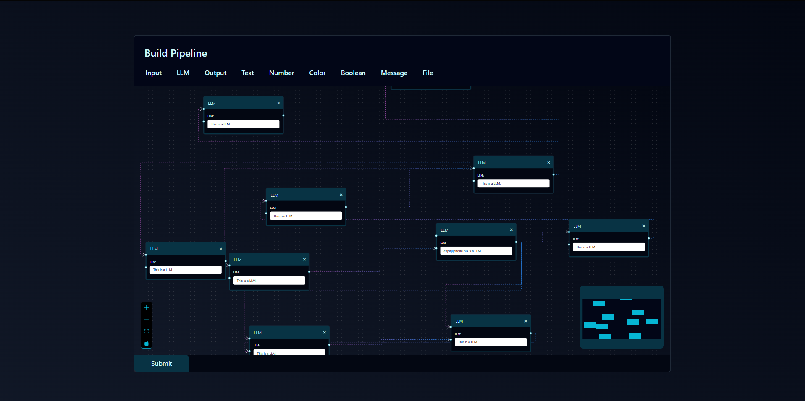

# Pipeline Flow Editor

This project is a React-based flow editor for building and visualizing pipelines, with a FastAPI backend for storing and retrieving pipeline data.

## Demo

You can watch a demo of the Pipeline Flow Editor below:

[](https://vimeo.com/1110545447?share=copy)

## Prerequisites

- Node.js (v18+ recommended)
- Python 3.8+
- npm (comes with Node.js)
- pip (comes with Python)

## Setup Instructions

### 1. Clone the Repository

```sh
git clone <your-repo-url>
cd frontend-20250815T125203Z-1-001
```

### 2. Install Frontend Dependencies

```sh
cd frontend
npm install
```

### 3. Install Backend Dependencies

```sh
cd ../backend
pip install fastapi uvicorn pydantic
```

### 4. Start the Backend Server

```sh
uvicorn main:app --reload
```

The backend will run at [http://localhost:8000](http://localhost:8000).

### 5. Start the Frontend Development Server

```sh
cd ../frontend
npm start
```

The frontend will run at [http://localhost:3000](http://localhost:3000).

## Usage

- Drag and drop node types from the toolbar to build your pipeline.
- Connect nodes visually.
- Click "Submit" to save the pipeline to the backend.
- The backend stores nodes and edges in `db.json` and provides endpoints to fetch or view the pipeline.

## API Endpoints

- `GET /pipelines/all` — Fetch all saved nodes and edges.
- `POST /pipelines/parse` — Save nodes and edges to the backend.
- `GET /` — View the pipeline data in a simple HTML table.

## Troubleshooting

- Make sure both frontend (`npm start`) and backend (`uvicorn main:app --reload`) are running.
- If you change backend code, restart the backend server.
- For CORS issues, ensure both servers are running on localhost.

## Learn More

- [React documentation](https://reactjs.org/)
- [FastAPI documentation](https://fastapi.tiangolo.com/)
